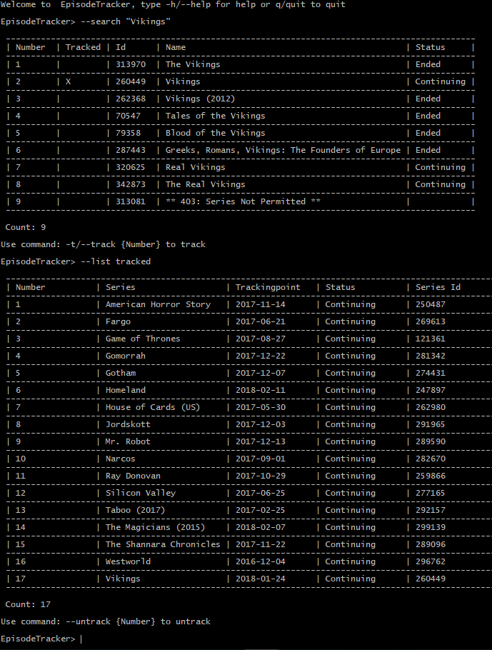

[](https://ci.appveyor.com/project/2mas/episodetracker) [](https://codecov.io/gh/2mas/EpisodeTracker)

# EpisodeTracker #

A Tv-show tracker that uses TheTVDB.com API v2. Search and add series to your trackinglist and get notified when new episodes are aired for your favourite series. Example of automatic usage is to add the CLI to an OS scheduler to call the update-method frequently, checking for updated series, sending you notifications via email for example when new episodes have arrived.

The library (EpisodeTracker.Core) is targeting netstandard2.0 and the CLI-part is an implementation for netcoreapp2.0

Feel free to contribute!

### How to run ###

To run this:

1. Clone the repo
2. ```dotnet restore``` and ```dotnet run --project EpisodeTracker.CLI```
3. Get api-keys at TheTVDB.com and modify bin/[Debug|Release]/Data/EpisodeTracker.json with your api credentials and endpoint to the api

Example of ApiCredentials-element:

```
"ApiCredentials": {
    "$type": "EpisodeTracker.Storage.ApiCredentials, EpisodeTracker",
    "ApiUrl": "https://api.thetvdb.com/",
    "ApiKey": "",
    "ApiUser": "",
    "ApiUserkey": ""
  }
```

## CLI-usage preview

